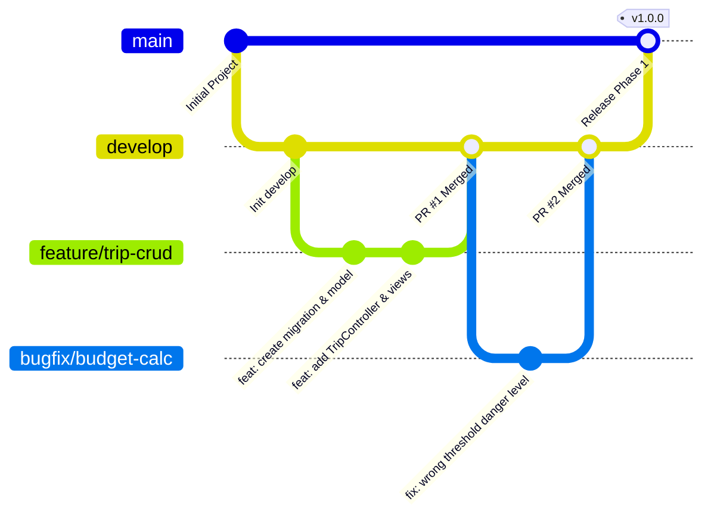

# WANDERLY — TEAM WORKFLOW & CODING CONVENTIONS

> **Dành cho:** Tất cả thành viên tham gia phát triển dự án Wanderly  
> **Ngăn xếp công nghệ:** Laravel 11 (PHP 8.3+) | Blade + Tailwind CSS 3 + Alpine.js 3 | MySQL 8.4  
> **Nhánh phát triển chính (Working Branch):** `develop`

---

## 1. Triết lý & Văn hóa Làm việc Nhóm

1. **Giao tiếp chủ động:** Mọi thắc mắc về nghiệp vụ, kiến trúc hoặc khi gặp lỗi (blocking) cần thông báo ngay trên kênh chat của team.
2. **Tôn trọng kiến trúc:** Tuân thủ nguyên tắc **"Skinny Controller, Fat Service"** (Controller chỉ điều phối, logic nằm ở `app/Services/`).
3. **Chất lượng hơn tốc độ:** Không commit code vội khi chưa test, không push code gây lỗi (đỏ màn hình / 500 error / gãy giao diện).
4. **Không tự merge code:** Mọi thay đổi đưa vào nhánh dùng chung phải thông qua Pull Request và được ít nhất 01 thành viên khác review.

---

## 2. Quy tắc Đặt tên & Coding Conventions

### 2.1. Backend (PHP 8.3 & Laravel 11)

| Thành phần | Quy tắc đặt tên | Ví dụ chuẩn | Ví dụ SAI |
| :--- | :--- | :--- | :--- |
| **Controller** | `PascalCase` + hậu tố `Controller` (số ít) | `TripController`, `ActivityController` | `tripsController`, `trip_controller` |
| **Model** | `PascalCase` (danh từ số ít) | `Trip`, `TripMember`, `RoomBooking` | `Trips`, `room_booking` |
| **Service** | `PascalCase` + hậu tố `Service` | `BudgetService`, `ItineraryService` | `budget`, `HandleBudget` |
| **Policy** | `PascalCase` + hậu tố `Policy` | `TripPolicy`, `ActivityPolicy` | `CheckTripPolicy`, `tripPolicy` |
| **FormRequest** | `PascalCase` (Động từ + Model + `Request`) | `StoreTripRequest`, `UpdateActivityRequest` | `TripRequest`, `storeTrip` |
| **Method / Function** | `camelCase` (bắt đầu bằng động từ) | `calculateTotalCost()`, `recomputeBudget()` | `Calculate_Cost()`, `budget()` |
| **Variable** | `camelCase` (rõ nghĩa, không viết tắt vô nghĩa) | `$currentTrip`, `$remainingBudget`, `$memberCount` | `$t`, `$data1`, `$trip_val` |
| **Constant** | `UPPER_SNAKE_CASE` | `MAX_LOGIN_ATTEMPTS`, `DEFAULT_SLOT` | `maxLogin`, `default_slot` |

> [!TIP]
> **Format Code tự động:** Trước khi commit, luôn chạy lệnh sau để chuẩn hóa toàn bộ code theo chuẩn PSR-12 của Laravel:
> ```bash
> php artisan pint
> ```

---

### 2.2. Database, Migrations & Eloquent

- **Tên bảng (Table):** `snake_case`, số nhiều (tiếng Anh).  
  *Ví dụ:* `users`, `trips`, `trip_members`, `activities`, `room_bookings`.
- **Khóa chính (Primary Key):** Luôn là `id` (`$table->id()`).
- **Khóa ngoại (Foreign Key):** `tên_model_số_ít_id`.  
  *Ví dụ:* `trip_id`, `user_id`.  
  *Khai báo chuẩn Laravel:* `$table->foreignId('trip_id')->constrained()->cascadeOnDelete();`
- **Tên cột (Column):** `snake_case`.  
  *Ví dụ:* `start_date`, `total_price`, `is_budget_public`.
- **Tiền tệ & Ngân sách:** Tuyệt đối dùng `decimal(12, 2)`, không dùng `float` hoặc `double` để tránh sai số tính toán.
- **Quan hệ Eloquent (Relationships):**
  - Quan hệ 1-1 hoặc N-1 (`belongsTo`, `hasOne`): Viết theo danh từ **số ít** (`camelCase`).  
    *Ví dụ:* `public function trip() { return $this->belongsTo(Trip::class); }`
  - Quan hệ 1-N hoặc N-N (`hasMany`, `belongsToMany`): Viết theo danh từ **số nhiều** (`camelCase`).  
    *Ví dụ:* `public function activities() { return $this->hasMany(Activity::class); }`

---

### 2.3. Frontend (Blade, Tailwind CSS & Alpine.js)

- **Blade Views:** Đặt trong `resources/views/`, tên file dùng `kebab-case`.
  - Views theo module: `resources/views/trips/index.blade.php`, `resources/views/trips/show.blade.php`.
  - Components tái sử dụng: `resources/views/components/trip-card.blade.php`.
- **CSS / Styling:**
  - Sử dụng **Tailwind CSS 3 utility classes**. Hạn chế tối đa viết CSS inline (`style="..."`).
  - Đảm bảo responsive trên các kích thước màn hình phổ biến (`sm:`, `md:`, `lg:`).
- **JavaScript & Alpine.js:**
  - Logic JS tách theo từng module tại `resources/js/modules/` (ví dụ: `timeline.js`, `budget.js`).
  - Biến và hàm trong Alpine.js / JS dùng `camelCase` (ví dụ: `activeTab`, `updateSlotPosition()`).

---

### 2.4. Routes & AJAX Endpoints

- **Tên Route (Route Name):** Dùng `kebab-case` hoặc `snake_case` nối dấu chấm theo phân cấp `chức_năng.hành_động`.  
  *Ví dụ:* `trips.index`, `trips.show`, `ajax.activities.update-order`.
- **Route AJAX:** Toàn bộ route phục vụ kéo thả timeline hoặc xử lý nền đặt tại `routes/ajax.php` (prefix `/ajax/`), luôn đi kèm CSRF Token và Auth middleware.

---

### 2.5. Chiến lược Đa ngôn ngữ (Localization & i18n Strategy — English First)

Dự án áp dụng chiến lược **Tiếng Anh làm ngôn ngữ chính (English First)**, cấu trúc sẵn sàng để mở rộng sang Tiếng Việt (`vi`) hoặc các ngôn ngữ khác trong tương lai:

- **Ngôn ngữ mặc định:** Toàn bộ hệ thống chạy Tiếng Anh (`en`) theo cấu hình chuẩn Laravel.
- **Quy tắc Vàng cho Giao diện & Thông báo:**
  - **Tuyệt đối không hardcode chuỗi ký tự trần** trên file Blade views, Controllers hay FormRequests.
  - Mọi nhãn nút bấm, tiêu đề, placeholder, thông báo flash và câu thông báo lỗi validate **bắt buộc bọc trong hàm helper đa ngôn ngữ của Laravel**:
    ```php
    // Trong Blade View:
    <button>{{ __('Create Trip') }}</button>
    <h1>{{ __('Welcome back, :name', ['name' => auth()->user()->name]) }}</h1>

    // Trong Controller / FormRequest / Service:
    session()->flash('success', __('Trip created successfully.'));
    'name.required' => __('The trip name field is required.'),
    ```
- **Quy trình mở rộng Đa ngôn ngữ sau này:**
  - Khi cần bổ sung Tiếng Việt, team chỉ cần tạo file `lang/vi.json` chứa các cặp key-value (ví dụ: `"Create Trip": "Tạo chuyến đi"`), hoàn toàn không cần phải sửa đổi hay refactor lại cấu trúc mã nguồn.

---

## 3. Quy chuẩn Git & Quy trình Quản lý Mã nguồn

Dự án áp dụng mô hình **Git Feature Branch** với nguyên tắc cốt lõi: **LÀM VIỆC TRÊN NHÁNH `develop`, NHÁNH `main` CHỈ DÀNH CHO BẢN PRODUCTION ỔN ĐỊNH**.



---

### 3.1. Phân định vai trò các Nhánh

| Tên nhánh | Vai trò | Quyền hạn & Quy tắc |
| :--- | :--- | :--- |
| **`main`** | Chứa code môi trường Production đã hoàn thiện, chạy ổn định tuyệt đối. | **Được bảo vệ (Protected):** Cấm push trực tiếp. Chỉ merge từ `develop` khi release phiên bản mới. |
| **`develop`** | Nhánh làm việc tập trung của cả nhóm, tích hợp mọi tính năng mới. | **Nhánh làm việc gốc:** Mọi feature/bugfix đều phân nhánh từ đây và tạo Pull Request merge ngược về đây. |
| **`feature/*`** | Nhánh phát triển tính năng mới. | Tạo từ `develop`, sau khi hoàn thành tạo PR vào `develop`. |
| **`bugfix/*`** | Nhánh sửa lỗi phát sinh trong quá trình phát triển. | Tạo từ `develop`, sau khi sửa xong tạo PR vào `develop`. |
| **`hotfix/*`** | Nhánh sửa lỗi khẩn cấp trực tiếp từ `main`. | Tạo từ `main`, merge vào cả `main` và `develop`. |

---

### 3.2. Quy tắc Đặt tên Nhánh (Branch Naming)

> **Cú pháp:** Luôn viết chữ thường (lowercase), không dấu, dùng dấu gạch ngang `-` để nối từ.

- **Tính năng mới:** `feature/ten-tinh-nang`  
  *Ví dụ:* `feature/trip-creation`, `feature/drag-drop-timeline`, `feature/budget-charts`
- **Sửa lỗi:** `bugfix/ten-loi`  
  *Ví dụ:* `bugfix/timeline-overlap-slot`, `bugfix/budget-not-updating`
- **Cấu hình & Tích hợp:** `config/ten-cau-hinh`  
  *Ví dụ:* `config/setup-tailwind-vite`, `config/mail-notification`
- **Tối ưu / Refactor code:** `refactor/ten-task`  
  *Ví dụ:* `refactor/budget-service-event`

---

### 3.3. Quy tắc Viết Commit Message (Conventional Commits)

Commit message bắt đầu bằng một **tiền tố (prefix)** để phân loại, tiếp theo là mô tả ngắn gọn, rõ ràng (có thể dùng tiếng Việt hoặc tiếng Anh):

| Tiền tố | Ý nghĩa | Ví dụ |
| :--- | :--- | :--- |
| `feat:` | Thêm tính năng mới hoặc màn hình mới | `feat: Xây dựng màn hình chi tiết Trip với Timeline 4 slots` |
| `fix:` | Sửa lỗi logic hoặc lỗi hiển thị | `fix: Sửa lỗi không cập nhật thứ tự khi kéo thả activity` |
| `ui:` | Cập nhật giao diện, CSS Tailwind, font chữ, bố cục | `ui: Căn chỉnh lại thanh tiến độ ngân sách và màu cảnh báo` |
| `refactor:` | Tái cấu trúc code (không đổi tính năng bên ngoài) | `refactor: Chuyển logic tính tổng chi phí sang BudgetService` |
| `test:` | Viết thêm hoặc chỉnh sửa Unit/Feature test | `test: Bổ sung Feature test kiểm tra quyền xem ngân sách của role viewer` |
| `docs:` | Cập nhật tài liệu, README, tài liệu API | `docs: Cập nhật tài liệu RULE_FOR_TEAM.md` |
| `chore:` | Cập nhật dependencies, config build, việc vặt | `chore: Cài đặt thư viện sortablejs qua npm` |

---

## 4. Vòng lặp Công việc Hàng ngày (Daily Routine)

Mỗi khi bắt đầu ca làm việc, các thành viên thực hiện nghiêm túc **4 bước** sau:

### Bước 1: Đồng bộ code mới nhất (CỰC KỲ QUAN TRỌNG)
Luôn lấy code mới nhất từ nhánh `develop` của nhóm về máy mình trước khi bắt đầu code:
```bash
git checkout develop
git pull origin develop
```

### Bước 2: Tạo nhánh cá nhân từ `develop`
```bash
git checkout -b feature/ten-task-cua-ban
# Ví dụ: git checkout -b feature/room-booking-ui
```

### Bước 3: Code và kiểm tra liên tục
- Mở Laragon (Apache/Nginx, MySQL) và chạy Vite dev server:
  ```bash
  npm run dev
  ```
- Kiểm tra tính năng ngay trên trình duyệt và theo dõi tab Console / Terminal.
- Thường xuyên format code bằng Pint: `php artisan pint`.
- **Quy tắc vàng:** Nếu code bị lỗi đỏ màn hình, lỗi PHP Fatal / 500 hoặc console báo lỗi JS thì **tuyệt đối không được commit**.

### Bước 4: Lưu và đẩy code lên GitHub cuối ngày
```bash
git status
git add .
git commit -m "feat: Mô tả công việc cụ thể đã hoàn thành trong ngày"
git push -u origin feature/ten-task-cua-ban
```

---

## 5. Quy trình Review và Ghép Code (Pull Request - PR)

Khi hoàn thành trọn vẹn một Task, thành viên thực hiện quy trình nộp bài (Pull Request):

```text
[feature/xxx]  --->  Tạo PR trên GitHub  --->  [Review & Approve]  --->  Merge vào [develop]
```

1. **Người tạo PR:**
   - Truy cập GitHub Repo: [Wanderly Repository](https://github.com/minhnhat-1504/Wanderly.git).
   - Chọn tạo **New Pull Request**.
   - **Cực kỳ lưu ý:** Base branch phải chọn là **`develop`** (không chọn `main`). Compare branch là nhánh `feature/...` của bạn.
   - Điền tiêu đề và mô tả rõ ràng:
     - Task này giải quyết vấn đề gì?
     - Đã test những kịch bản nào?
     - Đính kèm hình ảnh / video minh họa (nếu là UI).
   - Nhắn tin vào nhóm: *"Mình vừa tạo PR cho task [Tên task], nhờ bạn [Tên bạn] vào review giúp nhé!"*.

2. **Người Review (Thành viên khác):**
   - Đọc kỹ diff các file thay đổi (Files changed).
   - Kiểm tra xem code có tuân thủ quy tắc kiến trúc Service/Policy không.
   - Có bị dư thừa file rác (file tạm, dump code, `.env`) không.
   - Nếu đạt yêu cầu: Bấm **Approve** và tiến hành **Merge pull request** (chọn `Squash and merge` hoặc `Create a merge commit`).
   - Nếu còn điểm cần sửa: Comment trực tiếp vào dòng code kèm giải thích lý do.

> [!CAUTION]
> **Quy định bất khả xâm phạm:** Tuyệt đối **không tự bấm Merge Pull Request của chính mình**. Mọi PR phải có ít nhất **01 lượt Approve từ thành viên khác**.

---

## 6. Xử lý Xung đột Code (Merge Conflict)

### 6.1. Merge Conflict là gì?
Xung đột xảy ra khi 2 người cùng sửa chung một vị trí code trong cùng một file (ví dụ: cùng sửa `routes/web.php` hoặc cùng thêm cột vào một file migration). Khi đó Git không thể tự quyết định nên giữ lại đoạn code của ai.

### 6.2. Các bước xử lý chuẩn:
1. **Bình tĩnh — Không xóa file, không xóa nhánh bừa bãi.**
2. **Kéo code mới nhất của `develop` vào nhánh của bạn:**
   ```bash
   git checkout feature/ten-task-cua-ban
   git pull origin develop
   ```
3. **Mở VS Code / IDE để xem xung đột:**
   - VS Code sẽ đánh dấu đoạn bị trùng và hiện các nút bấm:
     - `Accept Current Change` (giữ code hiện tại của bạn)
     - `Accept Incoming Change` (lấy code mới từ develop)
     - `Accept Both Changes` (giữ cả hai đoạn)
4. **Trao đổi trực tiếp:** Nhắn tin hoặc gọi cho người có code bị xung đột để thống nhất phương án xử lý tốt nhất.
5. **Kiểm tra và hoàn tất:**
   - Lưu file lại.
   - Chạy thử dự án trên trình duyệt để đảm bảo mọi chức năng vẫn chạy bình thường.
   - Commit và push lại:
     ```bash
     git add .
     git commit -m "fix: Giải quyết conflict khi merge develop vào feature/..."
     git push origin feature/ten-task-cua-ban
     ```

---

## 7. Tiêu chuẩn Hoàn thành một Task (Definition of Done - DoD)

Một Task/Feature chỉ được coi là hoàn tất và đủ điều kiện để tạo PR khi thỏa mãn **100% các tiêu chí** sau:

- [ ] **Chức năng:** Nghiệp vụ chạy đúng theo yêu cầu của [PLAN.md](file:///d:/laragon/www/Wanderly/docs/PLAN.md) và thiết kế.
- [ ] **Đa ngôn ngữ (i18n):** Toàn bộ text giao diện (Blade views), nhãn, placeholder và thông báo (Flash, Validation) đều viết bằng Tiếng Anh chuẩn mực và được bọc đúng quy cách trong hàm `__('...')`.
- [ ] **Không lỗi Terminal / Console:** Không có Exception (500), không có Warning PHP, không có lỗi đỏ ở F12 Developer Tools.
- [ ] **Format chuẩn:** Đã chạy `php artisan pint` và không còn lỗi linting.
- [ ] **Database an toàn:**
  - Migrations mới chạy mượt mà (`php artisan migrate`).
  - Đã test chạy rollback thành công (`php artisan migrate:rollback`).
  - Dữ liệu tiền tệ sử dụng kiểu `DECIMAL(12, 2)`.
- [ ] **Giao diện chuẩn:**
  - Hiển thị responsive tốt trên cả Desktop và Mobile.
  - Sử dụng đúng bảng màu và utility classes của Tailwind CSS.
- [ ] **Bảo mật & Phân quyền:**
  - Route có middleware bảo vệ (`auth`, `verified` nếu cần).
  - Thao tác nhạy cảm được kiểm tra qua `TripPolicy` ở phía server.
- [ ] **Dọn dẹp code rác:**
  - Đã xóa toàn bộ `dd()`, `dump()`, `console.log()`, biến thừa và các đoạn comment không cần thiết.
  - Tuyệt đối **không commit file `.env`** hoặc thông tin mật (API key, mật khẩu DB). Nếu có biến môi trường mới, bắt buộc cập nhật vào `.env.example`.
