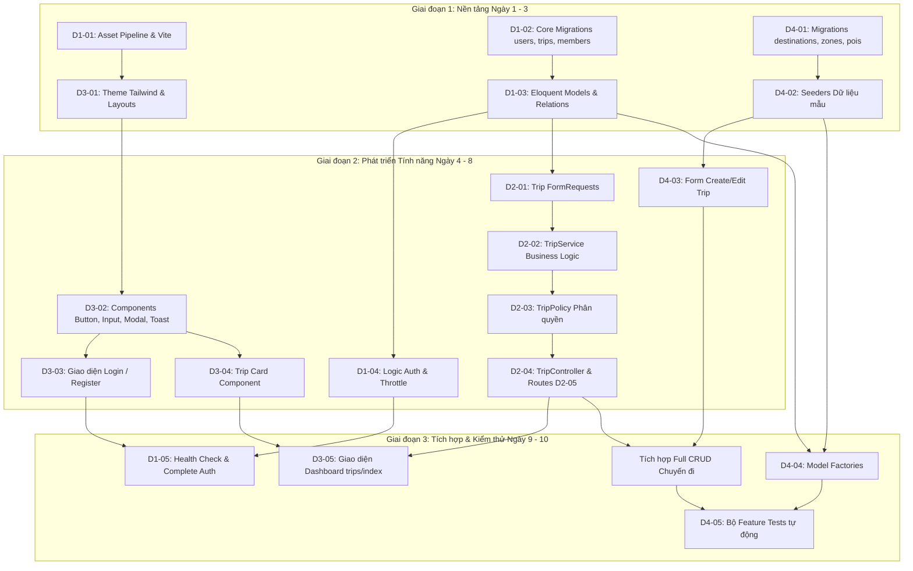

# SPRINT 1: NỀN TẢNG HỆ THỐNG, AUTH & QUẢN LÝ CHUYẾN ĐI CƠ BẢN

> **Dự án:** Wanderly — Nền tảng lập kế hoạch du lịch thông minh  
> **Thời lượng:** 2 Tuần (Tuần 1 – Tuần 2)  
> **Quy mô Team:** 4 Thành viên  
> **Nhánh phát triển chính:** `develop`  
> **Tài liệu tham chiếu:** [PLAN.md](file:///d:/laragon/www/Wanderly/docs/PLAN.md) | [RULE_FOR_TEAM.md](file:///d:/laragon/www/Wanderly/docs/RULE_FOR_TEAM.md) | OSP_SRS v2.0

---

## 1. Thông tin Chung & Đánh giá Tính Khả thi Sprint 1

### Đánh giá kế hoạch ban đầu:
- **Ưu điểm:**
  - Phân chia trách nhiệm rõ ràng cho 4 thành viên theo chuyên môn (Core/Auth, Backend Trip, Frontend Shell/Dashboard, Seed Data/Form/Test).
  - Bám sát kiến trúc *Skinny Controller, Fat Service* và quy chuẩn bảo mật phân quyền qua `TripPolicy`.
  - Giữ vững nguyên tắc cốt lõi: dữ liệu địa điểm lưu text, không phụ thuộc API bản đồ ngoài.
- **Điểm đã được chuẩn hóa & bổ sung trong tài liệu này:**
  - Hoàn thiện đầy đủ nội dung chi tiết cho Task `D1-04` (Validate FormRequest và Rate Limiting 5 lần/phút) và `D1-05` (Health check + Danh mục Auth Routes) vốn bị khuyết trong bản thảo sơ bộ.
  - Bổ sung sơ đồ phụ thuộc công việc (Task Dependencies) để các thành viên biết thứ tự phối hợp, tránh tình trạng bị nghẽn (blocked).
  - Bổ sung kịch bản kiểm thử tích hợp (End-to-End Demo Script) để nghiệm thu cuối Sprint.

---

## 2. Mục tiêu Tổng quan Sprint 1

1. **Thiết lập nền tảng kỹ thuật (Base Code Skeleton):** Khởi tạo khung dự án chuẩn mực trên Laravel 11, cấu hình môi trường chạy PHP 8.2+, Node 20+, MySQL 8 (InnoDB, collation `utf8mb4_unicode_ci`), tích hợp sẵn Vite, Tailwind CSS 3, Alpine.js 3, SortableJS, Chart.js và công cụ chuẩn hóa code Laravel Pint.
2. **Module 1 (M1) — Auth và tài khoản:** Xây dựng tính năng đăng ký, đăng nhập, hồ sơ cá nhân với mã hóa Bcrypt, cơ chế Rate Limiting chống brute-force (giới hạn 5 lần/phút) và phân quyền vai trò hệ thống (`traveler`, `provider`, `admin`).
3. **Module 2 (M2) — Quản lý chuyến đi (Trip Management):** Triển khai luồng nghiệp vụ tạo, sửa, xóa, xem danh sách chuyến đi (CRUD); tự động tính toán khoảng ngày; hiển thị giao diện Dashboard với thẻ đếm ngược ngày đi và thanh tiến trình ngân sách trực quan.
4. **Module 16 (M16) — Dữ liệu hệ thống ban đầu (Text-based POIs):** Xây dựng cấu trúc lưu trữ và Seeder dữ liệu điểm đến (Destinations), khu vực (Zones), địa điểm (POIs) thuần văn bản (text), tuyệt đối không phụ thuộc vào bất kỳ API bản đồ nào.
5. **Chuẩn hóa chất lượng và kiểm thử:** Đạt tỷ lệ bao phủ kiểm thử tự động (Feature/Unit Test) cho các luồng xác thực và quản lý chuyến đi, đảm bảo 100% mã nguồn vượt qua kiểm tra `php artisan pint` và `php artisan test`.

---

## 3. Quy tắc Chung Sprint 1 (Sprint Ground Rules)

- **Nhánh phát triển chuẩn:** Toàn bộ thành viên bắt đầu nhánh mới từ nhánh `develop` theo cú pháp quy định: `feature/ten-tinh-nang`. Nhánh `main` bị khóa, chỉ dùng cho bản phát hành ổn định.
- **Kiến trúc phân tầng nghiêm ngặt (Skinny Controller, Fat Service):** Controller chỉ làm nhiệm vụ tiếp nhận Request, ủy quyền phân quyền qua Policy, gọi Service xử lý nghiệp vụ và trả về View/JSON. Nghiệp vụ xử lý dữ liệu và tính toán phải nằm hoàn toàn trong `app/Services/`.
- **Quy tắc cơ sở dữ liệu bất biến:** Tuyệt đối không chỉnh sửa các file migration đã merge vào `develop`. Mọi thay đổi cấu trúc bảng bắt buộc tạo file migration mới. Kiểu dữ liệu tiền tệ/ngân sách bắt buộc dùng `DECIMAL(12, 2)`, không dùng `float` hoặc `double`.
- **Nguyên tắc vị trí dạng text (No Map API):** Toàn bộ dữ liệu vị trí phải lưu dưới dạng chuỗi ký tự (`name`, `address`, `zone_id`), không lưu tọa độ GPS, không gọi Google Maps, Mapbox hay OpenStreetMap.
- **Kiểm tra phân quyền phía Server:** Mọi thao tác can thiệp dữ liệu phải được xác thực quyền sở hữu thông qua `TripPolicy` phía backend; không được chỉ ẩn/hiện nút bấm ở giao diện Blade/Alpine.js.
- **Quy chuẩn kiểm duyệt mã nguồn (Pull Request):** Cấm tự merge PR của chính mình. Mỗi PR phải có tối thiểu 01 lượt Review và Approve từ thành viên khác, kèm ảnh chụp giao diện hoặc kết quả chạy lệnh test xanh trước khi merge vào `develop`.
- **Quy chuẩn mã nguồn (Code Style):** Chạy `php artisan pint` để tự động định dạng mã nguồn theo chuẩn PSR-12 trước khi tạo commit. Commit message tuân thủ quy tắc Conventional Commits (`feat:`, `fix:`, `ui:`, `refactor:`, `test:`, `chore:`).

---

## 4. Sơ đồ Phụ thuộc & Thứ tự Thực hiện giữa các Thành viên



---

## 5. Bảng Phân chia Công việc Chi tiết cho Team 4 người

### THÀNH VIÊN 1: Core Architecture, Auth & Database Foundation

* **Mục tiêu:** Cung cấp bộ khung dự án chạy được trên local, cấu hình asset pipeline, tạo cấu trúc migration các bảng lõi của hệ thống và hoàn thiện Module Auth (M1).
* **Nhiệm vụ chi tiết:**

| Task ID | Tên công việc | Vị trí thư mục | Tên file & Outcome chi tiết |
| :--- | :--- | :--- | :--- |
| **D1-01** | Khởi tạo cấu hình Framework & Asset Pipeline | Thư mục gốc,<br>`resources/js/`,<br>`resources/css/` | • `composer.json`, `package.json`: Cài đặt Laravel 11, Tailwind CSS 3, Alpine.js 3, SortableJS, Chart.js, Laravel Pint.<br>• `vite.config.js`: Cấu hình plugin Laravel load `resources/css/app.css` và `resources/js/app.js`.<br>• `resources/js/app.js`: Import Alpine.js (`window.Alpine = Alpine; Alpine.start();`), import SortableJS và Chart.js sẵn sàng cho toàn dự án.<br>• `resources/css/app.css`: Khai báo 3 directive `@tailwind base; @tailwind components; @tailwind utilities;`. |
| **D1-02** | Migration các bảng lõi Phase 1 | `database/migrations/` | • `xxxx_create_users_table.php`: Các cột `id`, `name`, `email` (unique), `password`, `role` (enum: 'traveler', 'provider', 'admin', default 'traveler'), `avatar` (nullable), `remember_token`, `timestamps`.<br>• `xxxx_create_trips_table.php`: Khóa chính `id`, `owner_id` (foreignId liên kết `users` on delete cascade), `name`, `destination`, `start_date` (date), `end_date` (date), `budget` (decimal: 12,2, default 0), `cover` (string, nullable), `privacy` (enum: 'private', 'group', 'public', default 'private'), `status` (enum: 'planning', 'ongoing', 'completed', default 'planning'), đánh index tại `owner_id`, `timestamps`.<br>• `xxxx_create_trip_members_table.php`: Khóa chính `id`, `trip_id` (foreignId cascade), `user_id` (foreignId cascade), `role` (enum: 'leader', 'editor', 'viewer'), `timestamps`, ràng buộc `unique(['trip_id', 'user_id'])`. |
| **D1-03** | Models Eloquent & Định nghĩa Quan hệ | `app/Models/` | • `User.php`: Khai báo `$fillable = ['name', 'email', 'password', 'role', 'avatar']`, `$hidden = ['password', 'remember_token']`, casts `'password' => 'hashed'`; quan hệ `trips()` (hasMany `Trip`), `tripMemberships()` (hasMany `TripMember`).<br>• `Trip.php`: Khai báo `$fillable`, casts: `'start_date' => 'date'`, `'end_date' => 'date'`, `'budget' => 'decimal:2'`; quan hệ `owner()` (belongsTo `User`), `members()` (hasMany `TripMember`), `users()` (belongsToMany `User` thông qua bảng `trip_members` kèm pivot `role`).<br>• `TripMember.php`: Khai báo `$fillable = ['trip_id', 'user_id', 'role']`; quan hệ `trip()` (belongsTo `Trip`), `user()` (belongsTo `User`). |
| **D1-04** | Xử lý logic Xác thực & Rate Limiting | `app/Http/Controllers/Auth/`,<br>`app/Http/Requests/Auth/` | • `RegisterRequest.php`: Validate `name` (required, string, max:255), `email` (required, email, max:255, unique:users), `password` (required, min:8, confirmed).<br>• `LoginRequest.php`: Validate `email` (required, email), `password` (required, string). Cấu hình throttle rate limiting: tối đa **5 lần thử/phút**, khóa tạm thời với thông báo cụ thể khi vượt ngưỡng.<br>• `AuthController.php`: Xử lý `showLoginForm`, `login`, `showRegisterForm`, `register`, `logout` (xóa session, invalidate token). Mật khẩu luôn hash qua Bcrypt (`Hash::make`). |
| **D1-05** | Health Check Endpoint & Route Auth | `routes/web.php` | • Route `GET /healthz`: Trả về JSON `{ "status": "ok", "database": "connected", "timestamp": "..." }` với HTTP code 200 nếu kết nối DB thành công; trả về HTTP code 500 nếu DB mất kết nối.<br>• Nhóm routes xác thực đầy đủ: `GET /login`, `POST /login`, `GET /register`, `POST /register`, `POST /logout` (có middleware `auth` và bảo vệ CSRF token). |

---

### THÀNH VIÊN 2: Backend Core — Trip Management & Authorization Policy

* **Mục tiêu:** Xây dựng toàn bộ tầng Service, FormRequest, Policy và Controller cho Module Quản lý chuyến đi (M2), xử lý nghiệp vụ tự động gán vai trò `leader` khi tạo trip.
* **Nhiệm vụ chi tiết:**

| Task ID | Tên công việc | Vị trí thư mục | Tên file & Outcome chi tiết |
| :--- | :--- | :--- | :--- |
| **D2-01** | FormRequest xác thực chuyến đi | `app/Http/Requests/Trip/` | • `StoreTripRequest.php`: Định nghĩa rules: `'name' => ['required', 'string', 'max:255']`, `'destination' => ['required', 'string', 'max:255']`, `'start_date' => ['required', 'date']`, `'end_date' => ['required', 'date', 'after_or_equal:start_date']`, `'budget' => ['required', 'numeric', 'min:0']`, `'privacy' => ['required', Rule::in(['private', 'group', 'public'])]`, `'cover' => ['nullable', 'image', 'max:3072']`. Tùy biến thông báo lỗi tiếng Việt thân thiện.<br>• `UpdateTripRequest.php`: Tái sử dụng các rules trên kèm kiểm tra trạng thái `'status' => ['sometimes', Rule::in(['planning', 'ongoing', 'completed'])]`. |
| **D2-02** | Xây dựng Service xử lý nghiệp vụ Trip | `app/Services/` | • `TripService.php`:<br>  - `createTrip(array $data, User $owner): Trip`: Mở `DB::beginTransaction()`, lưu chuyến đi mới với `owner_id = $owner->id`, tự động tạo bản ghi trong bảng `trip_members` với `user_id = $owner->id`, `trip_id = $trip->id` và `role = 'leader'`, thực hiện `DB::commit()`, rollback nếu có ngoại lệ.<br>  - `calculateTripDays(Trip $trip): int`: Trả về số lượng ngày của chuyến đi dựa trên `Carbon::parse($trip->start_date)->diffInDays($trip->end_date) + 1`.<br>  - `getDashboardTrips(User $user, ?string $search = null)`: Truy vấn danh sách chuyến đi mà user làm chủ sở hữu hoặc là thành viên, hỗ trợ tìm kiếm theo tên hoặc điểm đến, eager loading các quan hệ `members.user`.<br>  - `deleteTrip(Trip $trip): bool`: Xóa chuyến đi (kích hoạt cascade xóa các quan hệ con). |
| **D2-03** | Xây dựng Policy kiểm soát phân quyền | `app/Policies/` | • `TripPolicy.php`: Khai báo các Gate phân quyền chặt chẽ:<br>  - `view(User $user, Trip $trip)`: Cho phép nếu trip là `public`, hoặc user là owner/thành viên trong `trip_members`.<br>  - `update(User $user, Trip $trip)`: Chỉ cho phép nếu user có vai trò `leader` hoặc `editor` trong trip.<br>  - `delete(User $user, Trip $trip)`: Duy nhất user có vai trò `leader` mới có quyền xóa. Ném HTTP 403 Forbidden nếu không đủ quyền. |
| **D2-04** | Xây dựng Controller điều phối Chuyến đi | `app/Http/Controllers/Trip/` | • `TripController.php`: Áp dụng chuẩn Skinny Controller:<br>  - `index(Request $request)`: Nhận tham số tìm kiếm, gọi `TripService::getDashboardTrips()`, trả về view `trips.index`.<br>  - `create()`: Trả về view `trips.create` kèm danh sách gợi ý điểm đến.<br>  - `store(StoreTripRequest $request)`: Lấy dữ liệu validated, gọi `TripService::createTrip()`, chuyển hướng về `trips.show` kèm flash message thành công.<br>  - `show(Trip $trip)`: Kiểm tra `$this->authorize('view', $trip)`, tính toán số ngày qua `TripService`, trả về view `trips.show`.<br>  - `edit(Trip $trip)`: Kiểm tra `$this->authorize('update', $trip)`, trả về view `trips.edit`.<br>  - `update(UpdateTripRequest $request, Trip $trip)`: Kiểm tra policy, cập nhật trip, redirect kèm thông báo.<br>  - `destroy(Trip $trip)`: Kiểm tra `$this->authorize('delete', $trip)`, gọi `TripService::deleteTrip()`, redirect về danh sách chuyến đi. |
| **D2-05** | Khai báo Web Routes cho Chuyến đi | `routes/web.php` | • Đăng ký nhóm route yêu cầu middleware `auth`: `Route::resource('trips', TripController::class)` với đầy đủ 7 route chuẩn RESTful (`trips.index`, `trips.create`, `trips.store`, `trips.show`, `trips.edit`, `trips.update`, `trips.destroy`). |

---

### THÀNH VIÊN 3: Frontend Lead — Blade Master Shell, UI Components & Dashboard View

* **Mục tiêu:** Xây dựng hệ thống giao diện mẫu dùng chung bằng Tailwind CSS 3, bộ thành phần UI tái sử dụng và màn hình Dashboard danh sách chuyến đi (M2).
* **Nhiệm vụ chi tiết:**

| Task ID | Tên công việc | Vị trí thư mục | Tên file & Outcome chi tiết |
| :--- | :--- | :--- | :--- |
| **D3-01** | Cấu hình Theme & Layouts Master | `tailwind.config.js`,<br>`resources/views/layouts/` | • `tailwind.config.js`: Cấu hình màu thương hiệu teal primary `#0F766E`, font chữ mặc định `Be Vietnam Pro`, định nghĩa các breakpoint responsive.<br>• `resources/views/layouts/app.blade.php`: Khung HTML5 hoàn chỉnh nạp `@vite(['resources/css/app.css', 'resources/js/app.js'])`; Top Navbar gồm logo Wanderly, điều hướng, chuông thông báo, avatar dropdown (Profile, Đăng xuất); Toast container toàn cục; Modal container toàn cục; `@yield('content')`.<br>• `resources/views/layouts/guest.blade.php`: Khung giao diện căn giữa màn hình dành riêng cho các trang xác thực (Login/Register). |
| **D3-02** | Bộ thành phần UI dùng chung (Blade Components) | `resources/views/components/` | • `button.blade.php`: Hỗ trợ các biến thể `variant="primary"` (nền teal `#0F766E`, chữ trắng), `secondary`, `danger` (đỏ), `outline`; trạng thái disabled và spinner loading.<br>• `input.blade.php`: Gồm label, input field styled chuẩn Tailwind, tự động hiển thị viền đỏ và thông báo lỗi `@error`.<br>• `modal.blade.php`: Thành phần modal dùng Alpine.js (`x-data="{ open: false }"`), backdrop mờ, đóng khi bấm ESC hoặc click outside, slot header, body, footer.<br>• `toast.blade.php`: Thành phần hiển thị thông báo flash message hoặc phản hồi AJAX, tự động ẩn sau 3 giây hoặc đóng thủ công. |
| **D3-03** | Màn hình Giao diện Xác thực | `resources/views/auth/` | • `login.blade.php`: Kế thừa `layouts.guest`; form đăng nhập gồm Email, Password, checkbox "Ghi nhớ đăng nhập", nút Đăng nhập, liên kết sang trang Đăng ký; hiển thị lỗi validate.<br>• `register.blade.php`: Form đăng ký gồm Họ tên, Email, Mật khẩu, Xác nhận mật khẩu, nút Đăng ký, hiển thị chi tiết các lỗi kiểm tra dữ liệu. |
| **D3-04** | Thành phần Thẻ chuyến đi (Trip Card Component) | `resources/views/components/` | • `trip-card.blade.php`: Nhận `$trip` làm prop; thiết kế bo góc shadow nhẹ; ảnh bìa (fallback ảnh mặc định nếu null); nhãn đếm ngược số ngày ("Còn X ngày" nếu ở tương lai, "Đang diễn ra" nếu trong khoảng ngày, "Đã kết thúc" nếu quá hạn); tên chuyến đi, điểm đến dạng text; thanh tiến trình ngân sách (`<div class="h-2 rounded-full">`) với màu sắc động: xanh lá (<80%), vàng hổ phách (80-95%), đỏ (>95%); tag trạng thái và quyền riêng tư (`private`, `group`, `public`). |
| **D3-05** | Giao diện Dashboard danh sách Chuyến đi | `resources/views/trips/` | • `index.blade.php`: Kế thừa `layouts.app`; Header gồm câu chào, nút "Tạo chuyến đi mới" nổi bật (`x-button variant="primary"`); Thanh tìm kiếm lọc trip theo tên/điểm đến; Lưới hiển thị trip dạng grid responsive (`grid-cols-1 md:grid-cols-2 lg:grid-cols-3 gap-6`); Trạng thái Empty State trực quan khi chưa có chuyến đi nào (icon minh họa, text kêu gọi hành động). |

---

### THÀNH VIÊN 4: Destination Data, POI Seeder, Trip Form UI & Testing Foundation

* **Mục tiêu:** Xây dựng cơ sở dữ liệu và seed dữ liệu địa điểm text mẫu (M16), thiết kế giao diện form tạo/sửa chuyến đi, xây dựng bộ kiểm thử tự động (Feature Tests) ban đầu.
* **Nhiệm vụ chi tiết:**

| Task ID | Tên công việc | Vị trí thư mục | Tên file & Outcome chi tiết |
| :--- | :--- | :--- | :--- |
| **D4-01** | Migration bảng Dữ liệu điểm đến & POI (M16) | `database/migrations/` | • `xxxx_create_destinations_table.php`: Khóa chính `id`, `name` (string, ví dụ "Đà Lạt"), `description` (text, nullable), `timestamps`.<br>• `xxxx_create_zones_table.php`: Khóa chính `id`, `destination_id` (foreignId cascade), `name` (string, ví dụ "Trung tâm Phố", "Hồ Tuyền Lâm"), `timestamps`.<br>• `xxxx_create_pois_table.php`: Khóa chính `id`, `zone_id` (foreignId cascade), `name` (string, ví dụ "Tiệm Cà phê Túi Mơ To"), `address` (string text, ví dụ "Hẻm 31 Sào Nam, P. 11"), `category` (string: tham quan/ăn uống/cà phê), `typical_cost` (decimal: 12,2, default 0), `timestamps`. Tuyệt đối không chứa cột tọa độ lat/long. |
| **D4-02** | Xây dựng Seeders dữ liệu mẫu chuẩn | `database/seeders/` | • `DestinationSeeder.php`: Tạo dữ liệu mẫu cho 3 thành phố lớn (Đà Lạt, Đà Nẵng, Phú Quốc); mỗi thành phố có tối thiểu 2 Zone; mỗi Zone có tối thiểu 4 POI có tên, địa chỉ thực tế và chi phí điển hình để phục vụ demo và gợi ý chọn nhanh.<br>• `AdminUserSeeder.php`: Tạo sẵn 01 tài khoản Admin (`admin@wanderly.test`, role `admin`) và 01 tài khoản Traveler mẫu (`demo@wanderly.test`, role `traveler`).<br>• `DatabaseSeeder.php`: Khai báo gọi lần lượt `AdminUserSeeder` và `DestinationSeeder`, đảm bảo lệnh `php artisan migrate --seed` chạy thành công không lỗi. |
| **D4-03** | Giao diện Tạo & Sửa Chuyến đi | `resources/views/trips/` | • `create.blade.php`: Kế thừa `layouts.app`; form gồm: Tên chuyến đi (`x-input`), Điểm đến (datalist gợi ý từ bảng `destinations`), Ngày bắt đầu & Ngày kết thúc (`type="date"`), Ngân sách dự kiến (`type="number"`), Mức độ riêng tư (radio/select: Riêng tư, Nhóm, Công khai), Tải ảnh bìa; nút Submit "Khởi tạo chuyến đi" và nút "Hủy".<br>• `edit.blade.php`: Form tương tự `create.blade.php`, nạp sẵn dữ liệu cũ qua helper `old()`, bổ sung trường cập nhật trạng thái (`planning`, `ongoing`, `completed`). |
| **D4-04** | Xây dựng Model Factories phục vụ Test | `database/factories/` | • `UserFactory.php`: Sinh ngẫu nhiên tên, email, password mặc định `password`, role `traveler`.<br>• `TripFactory.php`: Sinh trip với `start_date` ngẫu nhiên trong 30 ngày tới, `end_date` tự động cộng thêm từ 3 đến 5 ngày, `budget` từ 2.000.000 đến 15.000.000 VND.<br>• `PoiFactory.php`: Sinh dữ liệu POI text ngẫu nhiên. |
| **D4-05** | Bộ Kiểm thử Tự động (Feature Tests) | `tests/Feature/` | • `AuthTest.php`: Viết test kiểm tra: User đăng ký thành công tài khoản mới; User đăng nhập thành công vào hệ thống; Người dùng nhập sai mật khẩu 5 lần liên tiếp sẽ bị chặn bởi throttle rate limit với mã lỗi HTTP 429.<br>• `TripCrudTest.php`: Viết test kiểm tra: Khách vãng lai (chưa đăng nhập) truy cập `/trips` bị redirect về `/login`; User đăng nhập tạo trip thành công; Validate chặn khi `end_date` nhỏ hơn `start_date` trả về lỗi HTTP 422; Xác minh sau khi tạo trip, bản ghi tương ứng trong `trip_members` tồn tại với đúng `user_id` và có `role` là `leader`. |

---

## 6. Tiêu chuẩn Nghiệm thu Sprint 1 (Sprint 1 Acceptance Criteria & DoD)

Dự án chỉ được coi là hoàn thành Sprint 1 khi đạt đủ **100% các tiêu chí** sau:

- [ ] Lệnh `php artisan migrate:fresh --seed` chạy trơn tru, không có lỗi ngoại lệ.
- [ ] Chạy `php artisan test` đạt **100% Pass** (bao gồm `AuthTest` và `TripCrudTest`).
- [ ] Chạy `php artisan pint` không báo bất kỳ lỗi vi phạm định dạng mã nguồn nào.
- [ ] Chạy `GET /healthz` trả về JSON trạng thái `200 OK` với thông tin kết nối Database.
- [ ] Cơ chế Rate Limiting hoạt động chính xác: Thử đăng nhập sai 5 lần sẽ kích hoạt throttle bảo vệ.
- [ ] Tạo chuyến đi mới thành công và người tạo tự động được gán vai trò `leader` trong bảng `trip_members`.
- [ ] Giao diện Dashboard responsive mượt mà trên Desktop và Mobile, các thẻ chuyến đi hiển thị đúng màu cảnh báo ngân sách và đếm ngược ngày đi.
- [ ] Toàn bộ nhánh của 4 thành viên đã được Review, Approve và Merge sạch sẽ vào nhánh `develop`.

---

## 7. Kịch bản Demo Cuối Sprint 1 (End-to-End Demo Flow)

```text
[1. Truy cập /register] -> Đăng ký tài khoản traveler mới
        ↓
[2. Tự động Login]      -> Chuyển hướng về Dashboard /trips (Thấy trạng thái Empty State)
        ↓
[3. Bấm Tạo Chuyến Đi]  -> Mở form /trips/create, chọn điểm đến gợi ý "Đà Lạt", nhập ngày & ngân sách
        ↓
[4. Submit Thành Công]  -> Điều hướng về trang chi tiết /trips/{id}, kiểm tra DB thấy vai trò leader
        ↓
[5. Quay lại Dashboard] -> Thấy Thẻ chuyến đi hiển thị: tên, điểm đến text, đếm ngược ngày, tiến độ budget
        ↓
[6. Thử Logout]         -> Đăng xuất an toàn, kiểm tra truy cập lại /trips bị chuyển hướng về /login
```
